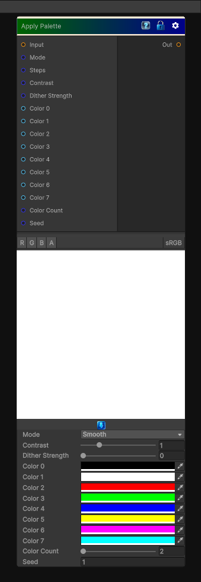

# Apply Palette

> This file is auto-generated by `Documentation/Generate-GenesisNodeDocs.ps1`.

[Back to index](../../README.md) | [Back to Color](../../color.md)

## Snapshot

## Details

- Menu: `Color/Apply Palette`
- Node group: `Color`
- Shader: `Hidden/Genesis/ApplyPalette`
- Source: [Runtime/Nodes/Color/ApplyPaletteNode.cs](../../../Doxygen/html/_apply_palette_node_8cs_source.html)

## Documentation

- Input grayscale -> remap to a color palette
- Supports 2-8 colors
- Supports stepped or smooth interpolation
- Supports palette indexing
- Fully deterministic
- CRT-safe
- Artist-friendly
