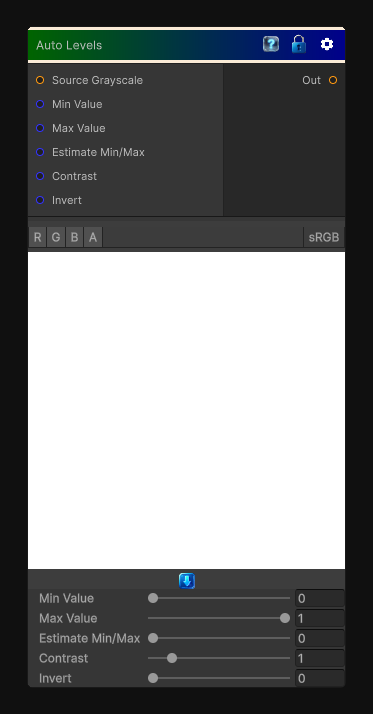

# Auto Levels

> This file is auto-generated by `Documentation/Generate-GenesisNodeDocs.ps1`.

[Back to index](../../README.md) | [Back to Color](../../color.md)

## Snapshot

## Details

- Menu: `Color/Auto Levels`
- Node group: `Color`
- Shader: `Hidden/Genesis/AutoLevels`
- Source: [Runtime/Nodes/Color/AutoLevelsNode.cs](../../../Doxygen/html/_auto_levels_node_8cs_source.html)

## Documentation

Per texture min/max remap, stretching the histogram so the darkest pixel is 0 and the brightest is 1
