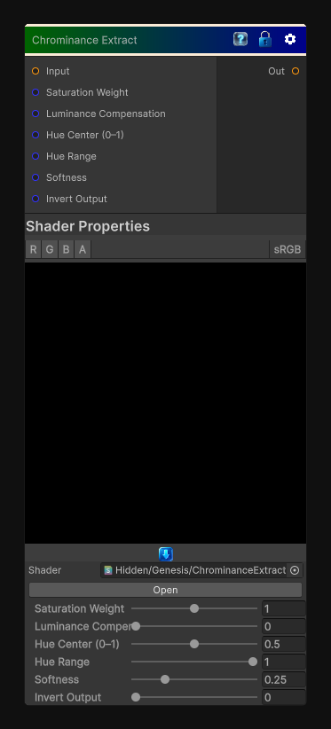

# Chrominance Extract

> This file is auto-generated by `Documentation/Generate-GenesisNodeDocs.ps1`.

[Back to index](../../README.md) | [Back to Color](../../color.md)

## Snapshot

## Details

- Menu: `Color/Chrominance Extract`
- Node group: `Color`
- Shader: `Hidden/Genesis/ChrominanceExtract`
- Source: [Runtime/Nodes/Color/ChrominanceExtractNode.cs](../../../../Runtime/Nodes/Color/ChrominanceExtractNode.cs)

## Documentation

- Extracts chroma (colorfulness) from RGB
- Supports multiple chroma models
- Optional hue isolation
- Optional saturation weighting
- Optional luminance compensation
- Fully deterministic
- CRT-safe
- Artist-friendly
