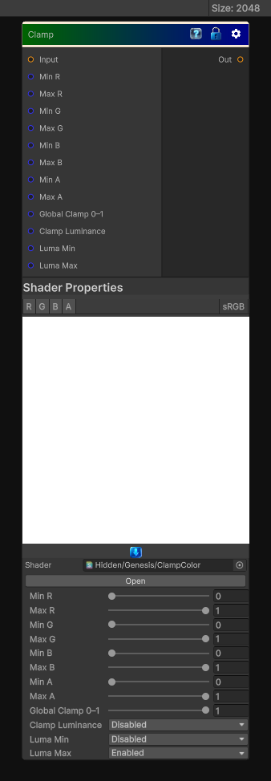

# Clamp

> This file is auto-generated by `Documentation/Generate-GenesisNodeDocs.ps1`.

[Back to index](../../README.md) | [Back to Color](../../color.md)

## Snapshot

## Details

- Menu: `Color/Clamp`
- Node group: `Color`
- Shader: `Hidden/Genesis/ClampColor`
- Source: [Runtime/Nodes/Color/ClampColorNode.cs](../../../../Runtime/Nodes/Color/ClampColorNode.cs)

## Documentation

- Clamp each channel independently
- Optional min/max per channel
- Optional global clamp (0-1)
- Fully CRT-safe
- Deterministic
- Artist-friendly
