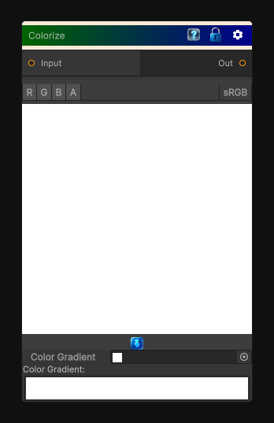

# Colorize

> This file is auto-generated by `Documentation/Generate-GenesisNodeDocs.ps1`.

[Back to index](../../README.md) | [Back to Color](../../color.md)

## Snapshot

## Details

- Menu: `Color/Colorize`
- Node group: `Color`
- Shader: `Hidden/Genesis/Colorize`
- Source: [Runtime/Nodes/Color/ColorizeNode.cs](../../../Doxygen/html/_colorize_node_8cs_source.html)

## Documentation

Converts a grayscale image to a colorized image based on a gradient
