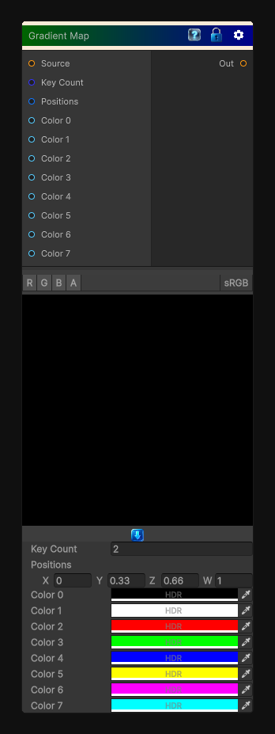

# Gradient Map

> This file is auto-generated by `Documentation/Generate-GenesisNodeDocs.ps1`.

[Back to index](../../README.md) | [Back to Color](../../color.md)

## Snapshot

## Details

- Menu: `Color/Gradient Map`
- Node group: `Color`
- Shader: `Hidden/Genesis/GradientMap`
- Source: [Runtime/Nodes/Color/GradientMapNode.cs](../../../Doxygen/html/_gradient_map_node_8cs_source.html)

## Documentation

- Full color-ramp remapping

- Arbitrary number of keys (up to 8)
You can expand to 16 if you want - the structure is already modular.

- Sorted key interpolation

- HDR color support
