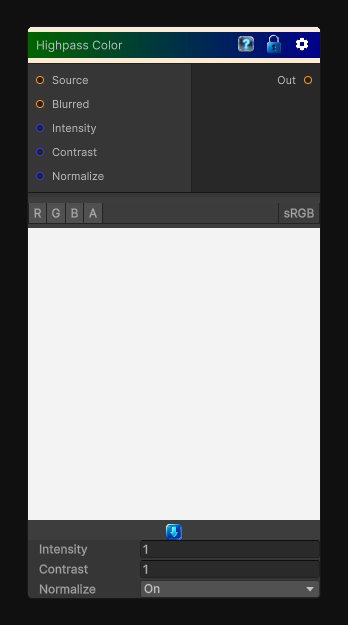

# Highpass Color

> This file is auto-generated by `Documentation/Generate-GenesisNodeDocs.ps1`.

[Back to index](../../README.md) | [Back to Color](../../color.md)

## Snapshot

## Details

- Menu: `Color/Highpass Color`
- Node group: `Color`
- Shader: `Hidden/Genesis/HighpassColor`
- Source: [Runtime/Nodes/Color/HighpassColorNode.cs](../../../Doxygen/html/_highpass_color_node_8cs_source.html)

## Documentation

Extracts high-frequency color detail from the input by blurring it, subtracting the blurred result from the original, and remapping the difference.

Use this to isolate fine detail before sharpening, blending, or mask creation while preserving color information.
