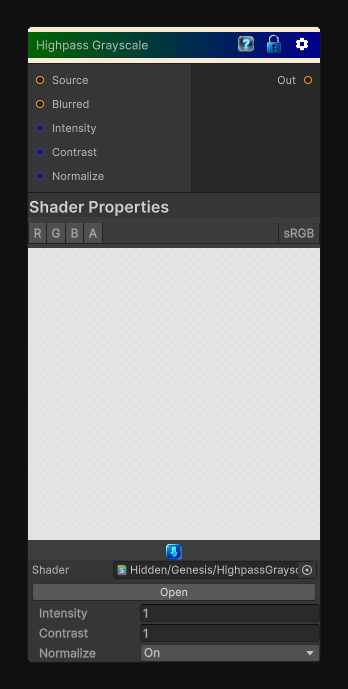

# Highpass Grayscale

> This file is auto-generated by `Documentation/Generate-GenesisNodeDocs.ps1`.

[Back to index](../../README.md) | [Back to Color](../../color.md)

## Snapshot

## Details

- Menu: `Color/Highpass Grayscale`
- Node group: `Color`
- Shader: `Hidden/Genesis/HighpassGrayscale`
- Source: [Runtime/Nodes/Color/HighpassGrayscaleNode.cs](../../../../Runtime/Nodes/Color/HighpassGrayscaleNode.cs)

## Documentation

Extracts high-frequency detail from the input by blurring it, subtracting the blurred result from the original, and remapping the difference into a grayscale result.

Use this to build detail masks, sharpen monochrome data, or isolate fine surface variation.
