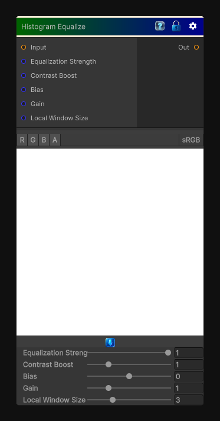

# Histogram Equalize

> This file is auto-generated by `Documentation/Generate-GenesisNodeDocs.ps1`.

[Back to index](../../README.md) | [Back to Color](../../color.md)

## Snapshot

## Details

- Menu: `Color/Histogram Equalize`
- Node group: `Color`
- Shader: `Hidden/Genesis/HistogramEqualize`
- Source: [Runtime/Nodes/Color/HistogramEqualizeNode.cs](../../../Doxygen/html/_histogram_equalize_node_8cs_source.html)

## Documentation

- Local histogram equalization (windowed CDF approximation)
- Contrast boost
- Adaptive normalization
- Bias + gain shaping
- Fully deterministic
- CRT-safe
- No texture sampling beyond the input
