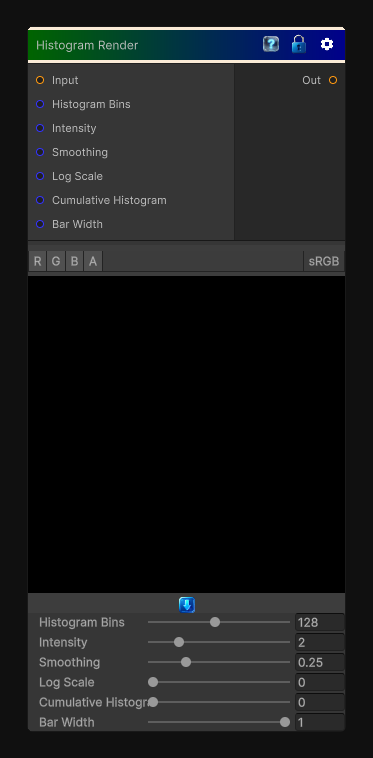

# Histogram Render

> This file is auto-generated by `Documentation/Generate-GenesisNodeDocs.ps1`.

[Back to index](../../README.md) | [Back to Color](../../color.md)

## Snapshot

## Details

- Menu: `Color/Histogram Render`
- Node group: `Color`
- Shader: `Hidden/Genesis/HistogramRender`
- Source: [Runtime/Nodes/Color/HistogramRenderNode.cs](../../../Doxygen/html/_histogram_render_node_8cs_source.html)

## Documentation

- Compute a histogram of the input grayscale
- Normalize it
- Render it as a bar graph
- Optional log scale
- Optional smoothing
- Optional cumulative mode
This version gives you:
- 256-bin histogram
- Linear or log scale
- Optional smoothing
- Optional cumulative histogram
- Adjustable bar width
- Adjustable intensity
- Fully deterministic
