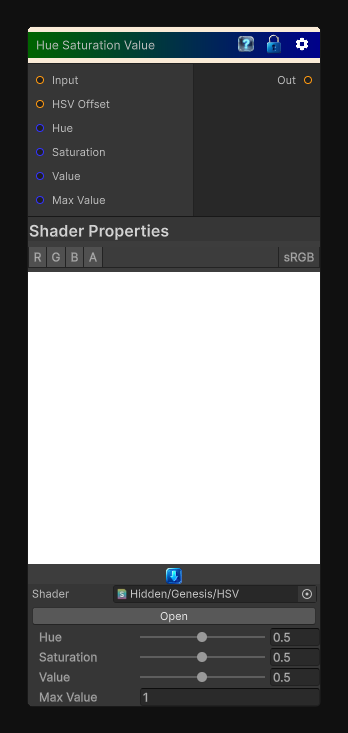

# Hue Saturation Value

> This file is auto-generated by `Documentation/Generate-GenesisNodeDocs.ps1`.

[Back to index](../../README.md) | [Back to Color](../../color.md)

## Snapshot

## Details

- Menu: `Color/Hue Saturation Value`
- Node group: `Color`
- Shader: `Hidden/Genesis/HSV`
- Source: [Runtime/Nodes/Color/HSVNode.cs](../../../../Runtime/Nodes/Color/HSVNode.cs)

## Documentation

Modify the image in the HSV color space.
