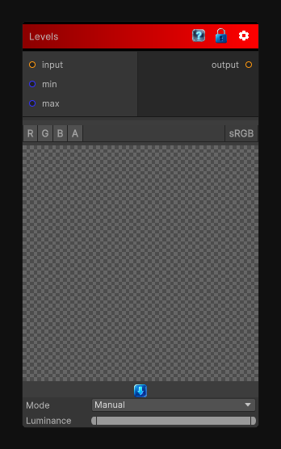

# Levels

> This file is auto-generated by `Documentation/Generate-GenesisNodeDocs.ps1`.

[Back to index](../../README.md) | [Back to Color](../../color.md)

## Snapshot

## Details

- Menu: `Color/Levels`
- Source: [Runtime/Nodes/Color/LevelsNode.cs](../../../Doxygen/html/_levels_node_8cs_source.html)

## Documentation

Adjusts black point, white point, gamma, and output range for the input.
