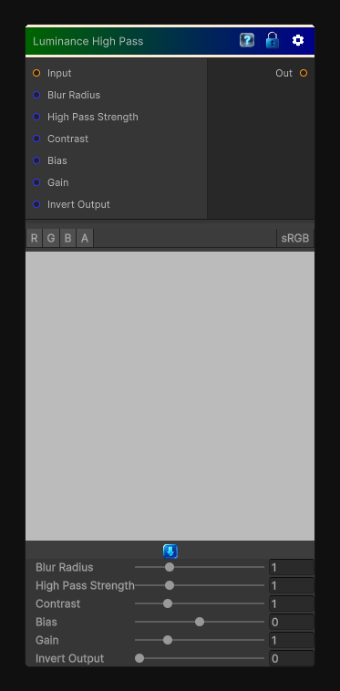

# Luminance High Pass

> This file is auto-generated by `Documentation/Generate-GenesisNodeDocs.ps1`.

[Back to index](../../README.md) | [Back to Color](../../color.md)

## Snapshot

## Details

- Menu: `Color/Luminance High Pass`
- Node group: `Color`
- Shader: `Hidden/Genesis/LuminanceHighPass`
- Source: [Runtime/Nodes/Color/LuminanceHighPassNode.cs](../../../Doxygen/html/_luminance_high_pass_node_8cs_source.html)

## Documentation

Luminance High Pass does this:
- Convert input to luminance
- Blur luminance (usually a small radius)
- Subtract blurred luminance from original luminance
- Normalize and clamp
- Optional contrast shaping
