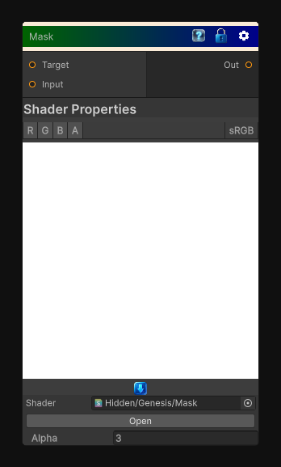

# Mask

> This file is auto-generated by `Documentation/Generate-GenesisNodeDocs.ps1`.

[Back to index](../../README.md) | [Back to Color](../../color.md)

## Snapshot

## Details

- Menu: `Color/Mask`
- Node group: `Color`
- Shader: `Hidden/Genesis/Mask`
- Source: [Runtime/Nodes/Color/MaskNode.cs](../../../../Runtime/Nodes/Color/MaskNode.cs)

## Documentation

Sample the target texture and mask it using input texture. Note that the mask is written in the alpha channel of the output.
