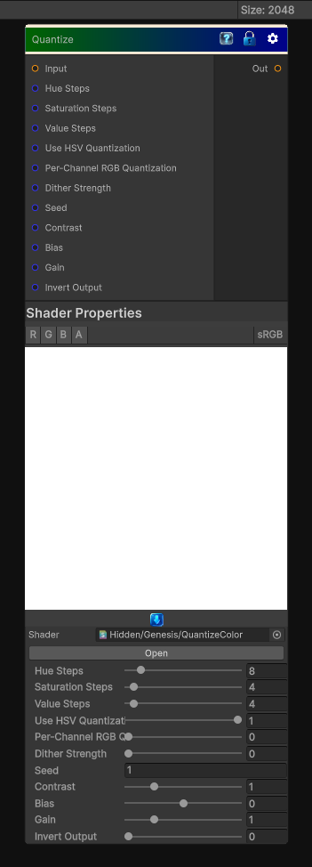

# Quantize

> This file is auto-generated by `Documentation/Generate-GenesisNodeDocs.ps1`.

[Back to index](../../README.md) | [Back to Color](../../color.md)

## Snapshot

## Details

- Menu: `Color/Quantize`
- Node group: `Color`
- Shader: `Hidden/Genesis/QuantizeColor`
- Source: [Runtime/Nodes/Color/QuantizeNode.cs](../../../../Runtime/Nodes/Color/QuantizeNode.cs)

## Documentation

Quantize Color Simple is the lightweight posterizer, but Quantize Color  is a more advanced, perceptually-aware quantizer. It doesn't just round channels - it quantizes in color space, usually HSV or HSL, and gives artists control over:
- Hue steps
- Saturation steps
- Value steps
- Quantization mode (per-channel, HSV, HSL)
- Dithering
- Preserving luminance
- Preserving saturation
