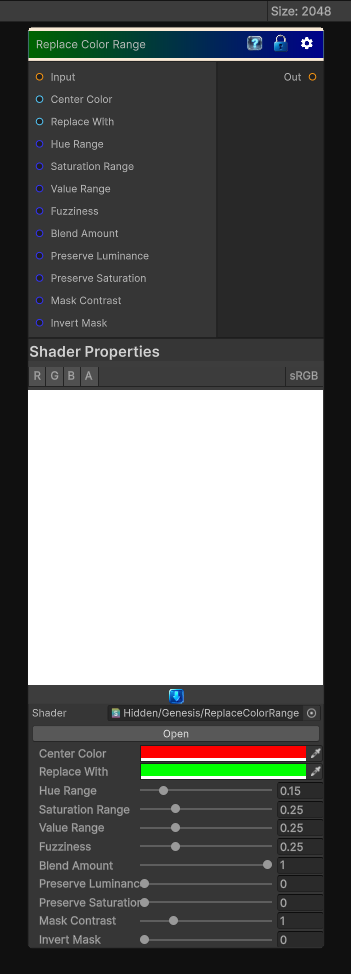

# Replace Color Range

> This file is auto-generated by `Documentation/Generate-GenesisNodeDocs.ps1`.

[Back to index](../../README.md) | [Back to Color](../../color.md)

## Snapshot

## Details

- Menu: `Color/Replace Color Range`
- Node group: `Color`
- Shader: `Hidden/Genesis/ReplaceColorRange`
- Source: [Runtime/Nodes/Color/ReplaceColorRangeNode.cs](../../../../Runtime/Nodes/Color/ReplaceColorRangeNode.cs)

## Documentation

Replace Color Range is the natural evolution of Replace Color - instead of targeting a single color, you target a band of colors defined by:
- A center color
- A hue range
- A saturation range
- A value (luminance) range
- A fuzziness falloff
- A replacement color
- A blend amount
Think of it as Histogram Select + Replace Color, but in HSV space.
This is extremely useful for stylized workflows:
- Replace all warm hues with cool hues
- Replace all greens with a stylized palette
- Replace all dark reds with bright oranges
- Replace all desaturated colors with a new tone
