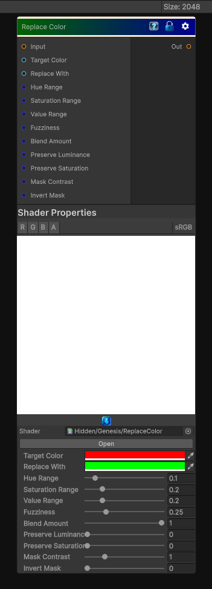

# Replace Color

> This file is auto-generated by `Documentation/Generate-GenesisNodeDocs.ps1`.

[Back to index](../../README.md) | [Back to Color](../../color.md)

## Snapshot

## Details

- Menu: `Color/Replace Color`
- Node group: `Color`
- Shader: `Hidden/Genesis/ReplaceColor`
- Source: [Runtime/Nodes/Color/ReplaceColorNode.cs](../../../../Runtime/Nodes/Color/ReplaceColorNode.cs)

## Documentation

- Selects a target color
- Computes distance in color space (usually HSV or HSL)
- Applies a falloff (threshold + fuzziness)
- Replaces the selected region with a new color
- Optionally blends between original and replaced color
- Supports hue-only, saturation-only, or full-color replacement
