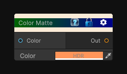

# Color Matte

> This file is auto-generated by `Documentation/Generate-GenesisNodeDocs.ps1`.

[Back to index](../../README.md) | [Back to Color](../../color.md)

## Snapshot

## Details

- Menu: `Color/Uniform Color`
- Aliases: `Color/Color Matte`
- Node group: `Color`
- Shader: `Hidden/Genesis/ColorMatte`
- Source: [Runtime/Nodes/Color/ColorMatteNode.cs](../../../Doxygen/html/_color_matte_node_8cs_source.html)

## Documentation

Generate a texture from an HDR color.
