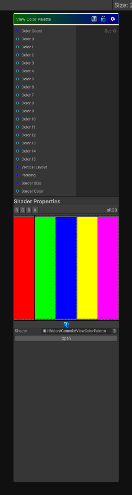

# View Color Palette

> This file is auto-generated by `Documentation/Generate-GenesisNodeDocs.ps1`.

[Back to index](../../README.md) | [Back to Color](../../color.md)

## Snapshot

## Details

- Menu: `Color/View Color Palette`
- Node group: `Color`
- Shader: `Hidden/Genesis/ViewColorPalette`
- Source: [Runtime/Nodes/Color/ViewColorPaletteNode.cs](../../../../Runtime/Nodes/Color/ViewColorPaletteNode.cs)

## Documentation

- Displays 2-16 palette colors
- Supports horizontal or vertical layout
- Supports padding
- Supports border thickness + color
- Supports per-swatch labels (optional grayscale stripes)
