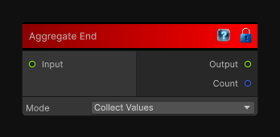

# Aggregate End

> This file is auto-generated by `Documentation/Generate-GenesisNodeDocs.ps1`.

[Back to index](../../README.md) | [Back to Conditional](../../conditional.md)

## Snapshot

## Details

- Menu: `Conditional/Aggregate End`
- Aliases: `Conditional/Reduce End`
- Node group: `Conditional`
- Source: [Runtime/Nodes/FlowControl/AggregateEnd.cs](../../../Doxygen/html/_aggregate_end_8cs_source.html)

## Documentation

Closes a loop flow block and aggregates the loop-end input values across iterations.
