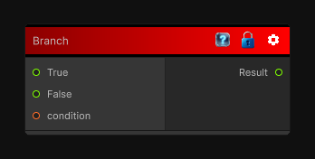

# Branch

> This file is auto-generated by `Documentation/Generate-GenesisNodeDocs.ps1`.

[Back to index](../../README.md) | [Back to Conditional](../../conditional.md)

## Snapshot

## Details

- Menu: `Conditional/Branch`
- Aliases: `Conditional/If`
- Node group: `Conditional`
- Source: [Runtime/Nodes/FlowControl/Branch.cs](../../../Doxygen/html/_branch_8cs_source.html)

## Documentation

Conditionally outputs either the true of false value depending on the condition value.
