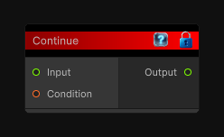

# Continue

> This file is auto-generated by `Documentation/Generate-GenesisNodeDocs.ps1`.

[Back to index](../../README.md) | [Back to Conditional](../../conditional.md)

## Snapshot

## Details

- Menu: `Conditional/Continue`
- Node group: `Conditional`
- Source: [Runtime/Nodes/FlowControl/ContinueNode.cs](../../../Doxygen/html/_continue_node_8cs_source.html)

## Documentation

Passes the input through and skips the rest of the current loop iteration when the condition is true.

Place this node on the loop's main value path when you want its input to become the loop end value for the continued iteration.
