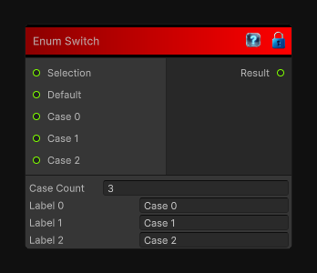

# Enum Switch

> This file is auto-generated by `Documentation/Generate-GenesisNodeDocs.ps1`.

[Back to index](../../README.md) | [Back to Conditional](../../conditional.md)

## Snapshot

## Details

- Menu: `Conditional/Enum Switch`
- Node group: `Conditional`
- Source: [Runtime/Nodes/FlowControl/EnumSwitchNode.cs](../../../Doxygen/html/_enum_switch_node_8cs_source.html)

## Documentation

Selects one of several case inputs by matching the selection value's text against named case labels.

This is useful for enum-like branching where the incoming selection value can be converted to a readable label with ToString().
