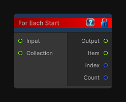

# For Each Start

> This file is auto-generated by `Documentation/Generate-GenesisNodeDocs.ps1`.

[Back to index](../../README.md) | [Back to Conditional](../../conditional.md)

## Snapshot

## Details

- Menu: `Conditional/For Each Start`
- Aliases: `Conditional/For Each`
- Node group: `Conditional`
- Source: [Runtime/Nodes/FlowControl/ForEachStart.cs](../../../Doxygen/html/_for_each_start_8cs_source.html)

## Documentation

Begins a for-each loop flow block over a collection input.

The loop carries an input value between iterations while also exposing the current item, item index, and collection count.
