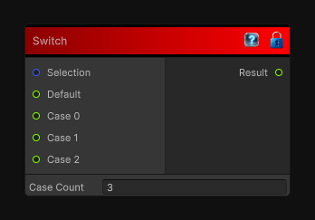

# Switch

> This file is auto-generated by `Documentation/Generate-GenesisNodeDocs.ps1`.

[Back to index](../../README.md) | [Back to Conditional](../../conditional.md)

## Snapshot

## Details

- Menu: `Conditional/Switch`
- Aliases: `Conditional/Switch Statement`
- Node group: `Conditional`
- Source: [Runtime/Nodes/FlowControl/SwitchNode.cs](../../../Doxygen/html/_switch_node_8cs_source.html)

## Documentation

Selects one of several case inputs using an integer selection index.

If the selection is outside the available case range, the default input is returned instead.
