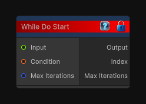

# While Do Start

> This file is auto-generated by `Documentation/Generate-GenesisNodeDocs.ps1`.

[Back to index](../../README.md) | [Back to Conditional](../../conditional.md)

## Snapshot

## Details

- Menu: `Conditional/While Do Start`
- Aliases: `Conditional/Do While Start`
- Node group: `Conditional`
- Source: [Runtime/Nodes/FlowControl/WhileDoStart.cs](../../../Doxygen/html/_while_do_start_8cs_source.html)

## Documentation

Begins a while-do loop flow block.

The loop body always runs once, then continues while the condition input remains true and the max-iteration safety cap is not reached.
