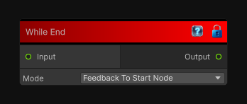

# While End

> This file is auto-generated by `Documentation/Generate-GenesisNodeDocs.ps1`.

[Back to index](../../README.md) | [Back to Conditional](../../conditional.md)

## Snapshot

## Details

- Menu: `Conditional/While End`
- Source: [Runtime/Nodes/FlowControl/WhileEnd.cs](../../../Doxygen/html/_while_end_8cs_source.html)

## Documentation

Closes a while-loop flow block.
