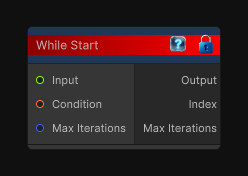

# While Start

> This file is auto-generated by `Documentation/Generate-GenesisNodeDocs.ps1`.

[Back to index](../../README.md) | [Back to Conditional](../../conditional.md)

## Snapshot

## Details

- Menu: `Conditional/While Start`
- Aliases: `Conditional/While`
- Node group: `Conditional`
- Source: [Runtime/Nodes/FlowControl/WhileStart.cs](../../../Doxygen/html/_while_start_8cs_source.html)

## Documentation

Begins a while-loop flow block.

The loop body only runs while the condition is already true before the first iteration, and it continues while the condition stays true and the max-iteration safety cap is not reached.
