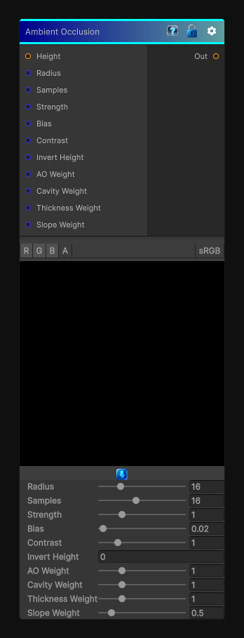

# Ambient Occlusion

> This file is auto-generated by `Documentation/Generate-GenesisNodeDocs.ps1`.

[Back to index](../../README.md) | [Back to Effects](../../effects.md)

## Snapshot

## Details

- Menu: `Effects/Ambient Occlusion`
- Shader: `Hidden/Genesis/SmartMaskSuite`
- Source: [Runtime/Nodes/Effects/Effects/AmbientOcclusionNode.cs](../../../Doxygen/html/_ambient_occlusion_node_8cs_source.html)

## Documentation

Builds a broad ambient-occlusion style mask from the incoming height field.

Use this when you want:
- Large-scale dirt and shadow masks
- Soft contact darkening
- A reusable base for wear and deposition
