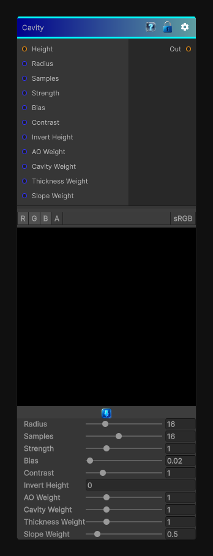

# Cavity

> This file is auto-generated by `Documentation/Generate-GenesisNodeDocs.ps1`.

[Back to index](../../README.md) | [Back to Effects](../../effects.md)

## Snapshot

## Details

- Menu: `Effects/Cavity`
- Shader: `Hidden/Genesis/SmartMaskSuite`
- Source: [Runtime/Nodes/Effects/Effects/CavityNode.cs](../../../Doxygen/html/_cavity_node_8cs_source.html)

## Documentation

Extracts concave cavity information from a height field.

This is useful for:
- Dust and grime buildup masks
- Crack enhancement
- Fine material breakup
