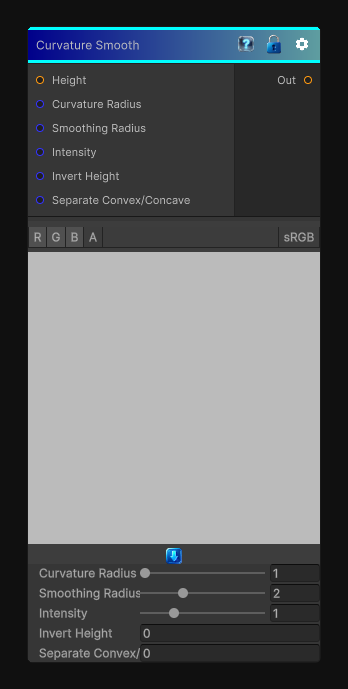

# Curvature Smooth

> This file is auto-generated by `Documentation/Generate-GenesisNodeDocs.ps1`.

[Back to index](../../README.md) | [Back to Effects](../../effects.md)

## Snapshot

## Details

- Menu: `Effects/Curvature Smooth`
- Node group: `Effects`
- Shader: `Hidden/Genesis/CurvatureSmooth`
- Source: [Runtime/Nodes/Effects/Effects/CurvatureSmoothNode.cs](../../../Doxygen/html/_curvature_smooth_node_8cs_source.html)

## Documentation

Simulates Substance's Curvature Smooth node from a height map: convex/concave detection via a Laplacian-style kernel, remapped to 0-1, with optional separate convex/concave outputs.
