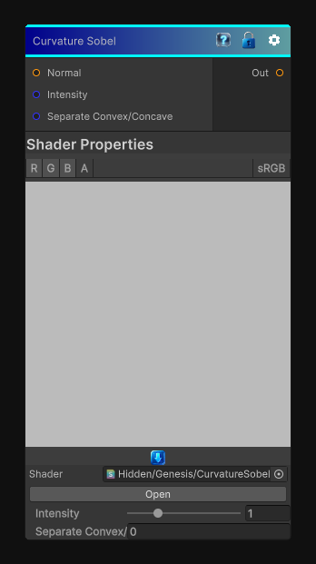

# Curvature Sobel

> This file is auto-generated by `Documentation/Generate-GenesisNodeDocs.ps1`.

[Back to index](../../README.md) | [Back to Effects](../../effects.md)

## Snapshot

## Details

- Menu: `Effects/Curvature Sobel`
- Node group: `Effects`
- Shader: `Hidden/Genesis/CurvatureSobel`
- Source: [Runtime/Nodes/Effects/Effects/CurvatureSobelNode.cs](../../../../Runtime/Nodes/Effects/Effects/CurvatureSobelNode.cs)

## Documentation

- Sharper, more detailed curvature
- Better edge detection
- More stable results on noisy heightmaps
- Convex / concave separation
- Fully compatible with 2D / 3D / Cube CRT sampling
