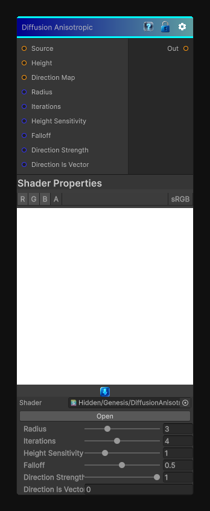

# Diffusion Anisotropic

> This file is auto-generated by `Documentation/Generate-GenesisNodeDocs.ps1`.

[Back to index](../../README.md) | [Back to Effects](../../effects.md)

## Snapshot

## Details

- Menu: `Effects/Diffusion Anisotropic`
- Node group: `Effects`
- Shader: `Hidden/Genesis/DiffusionAnisotropic`
- Source: [Runtime/Nodes/Effects/Effects/DiffusionAnisotropicNode.cs](../../../../Runtime/Nodes/Effects/Effects/DiffusionAnisotropicNode.cs)

## Documentation

A multi-iteration direction influenced
- 	With edge-preserving falloff
- 	Driven by height differences
- 	Producing a soft, organic spreading effect (like watercolor diffusion or clay smearing)
