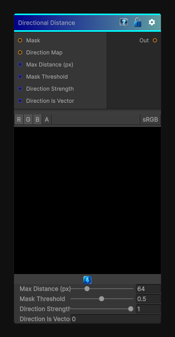

# Directional Distance

> This file is auto-generated by `Documentation/Generate-GenesisNodeDocs.ps1`.

[Back to index](../../README.md) | [Back to Effects](../../effects.md)

## Snapshot

## Details

- Menu: `Effects/Directional Distance`
- Node group: `Effects`
- Shader: `Hidden/Genesis/DirectionalDistance`
- Source: [Runtime/Nodes/Effects/Effects/DirectionalDistanceNode.cs](../../../Doxygen/html/_directional_distance_node_8cs_source.html)

## Documentation

It computes distance to a feature (usually black/white mask) along a specified direction, not radially.

- - Direction map (angle or vector)
- - Distance accumulation along direction
- - Adjustable max distance
- - Height/mask thresholding
- - Works for 2D / 3D / Cube
- - Deterministic, no loops dependent on texture size
