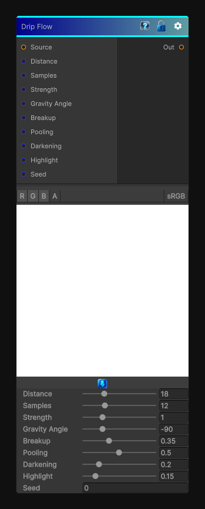

# Drip Flow

> This file is auto-generated by `Documentation/Generate-GenesisNodeDocs.ps1`.

[Back to index](../../README.md) | [Back to Effects](../../effects.md)

## Snapshot

## Details

- Menu: `Effects/Drip Flow`
- Shader: `Hidden/Genesis/FlowEffectSuite`
- Source: [Runtime/Nodes/Effects/Effects/DripFlowNode.cs](../../../Doxygen/html/_drip_flow_node_8cs_source.html)

## Documentation

Pushes the source texture along a gravity-biased flow field to create streaks and drips.

This node is useful for:
- Vertical grime
- Paint runs
- Water streaking and runoff
