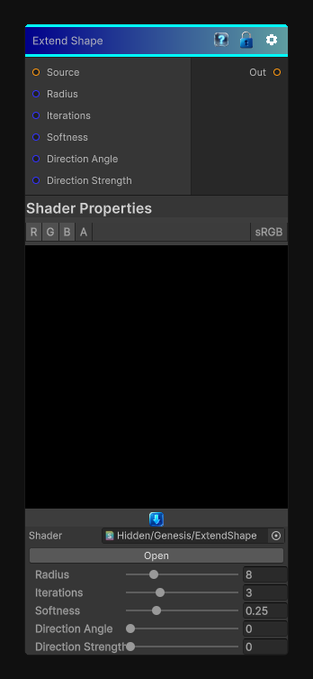

# Extend Shape

> This file is auto-generated by `Documentation/Generate-GenesisNodeDocs.ps1`.

[Back to index](../../README.md) | [Back to Effects](../../effects.md)

## Snapshot

## Details

- Menu: `Effects/Extend Shape`
- Node group: `Effects`
- Shader: `Hidden/Genesis/ExtendShape`
- Source: [Runtime/Nodes/Effects/Effects/ExtendShapeNode.cs](../../../../Runtime/Nodes/Effects/Effects/ExtendShapeNode.cs)

## Documentation

- - True morphological dilation
- - Radius-based expansion
- - Soft falloff ("Smooth" mode)
- - Iterative growth
- - Optional directional bias (like Extend Shape Directional)
- - Works for 2D / 3D / Cube
