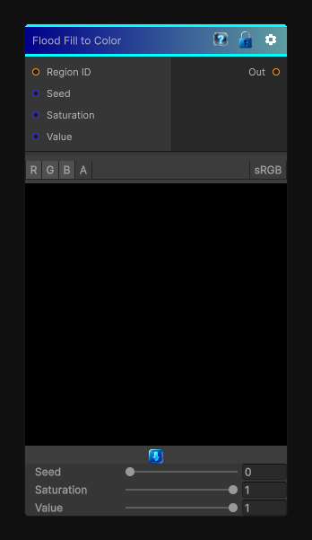

# Flood Fill to Color

> This file is auto-generated by `Documentation/Generate-GenesisNodeDocs.ps1`.

[Back to index](../../README.md) | [Back to Effects](../../effects.md)

## Snapshot

## Details

- Menu: `Effects/Flood Fill to Color`
- Node group: `Effects`
- Shader: `Hidden/Genesis/FloodFillToColor`
- Source: [Runtime/Nodes/Effects/Effects/FloodFillToColorNode.cs](../../../Doxygen/html/_flood_fill_to_color_node_8cs_source.html)

## Documentation

- One unique color per region
- Colors are stable (seeded by region ID)
- Fully deterministic
- Works for any number of regions
- Perfect for debugging segmentation or stylized region masks
