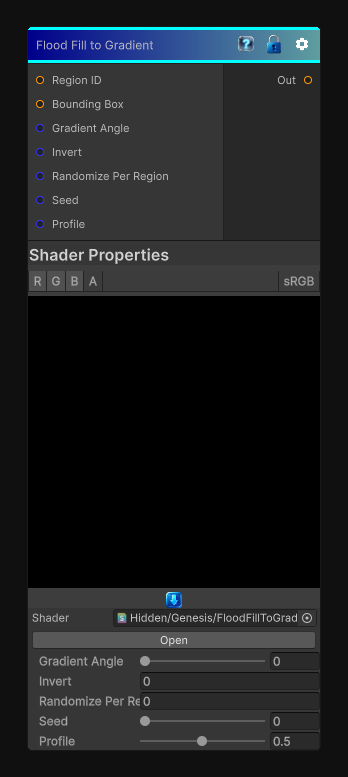

# Flood Fill to Gradient

> This file is auto-generated by `Documentation/Generate-GenesisNodeDocs.ps1`.

[Back to index](../../README.md) | [Back to Effects](../../effects.md)

## Snapshot

## Details

- Menu: `Effects/Flood Fill to Gradient`
- Node group: `Effects`
- Shader: `Hidden/Genesis/FloodFillToGradient`
- Source: [Runtime/Nodes/Effects/Effects/FloodFillToGradientNode.cs](../../../../Runtime/Nodes/Effects/Effects/FloodFillToGradientNode.cs)

## Documentation

This node takes the Region ID map and the Bounding Box map and produces a per-region gradient, exactly like Substance:
- - Gradient runs inside each region, not globally
- - Uses the region's bounding box to normalize coordinates
- - Supports direction angle, invert, profile, random per-region rotation
- - Fully deterministic
- - Fully Genesis CRT-compliant (2D / 3D / Cube, SAMPLE_X, GenesisFragment)
