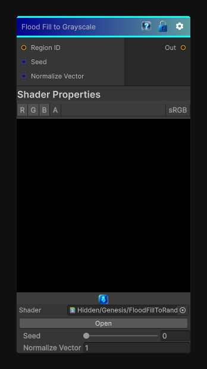

# Flood Fill to Grayscale

> This file is auto-generated by `Documentation/Generate-GenesisNodeDocs.ps1`.

[Back to index](../../README.md) | [Back to Effects](../../effects.md)

## Snapshot

## Details

- Menu: `Effects/Flood Fill to Random Vector`
- Node group: `Effects`
- Shader: `Hidden/Genesis/FloodFillToRandomVector`
- Source: [Runtime/Nodes/Effects/Effects/FloodFillToRandomVectorNode.cs](../../../../Runtime/Nodes/Effects/Effects/FloodFillToRandomVectorNode.cs)

## Documentation

This node is the vector-based sibling of:
- 	Flood Fill to Random Grayscale
- 	Flood Fill to Color
But instead of grayscale or color, each region gets a stable random 2D vector - perfect for:
- 	Anisotropic effects
- 	Direction-aware noise
- 	Flow-aligned stylization
- 	Region-based vector fields
- 	Procedural fiber/grain direction
