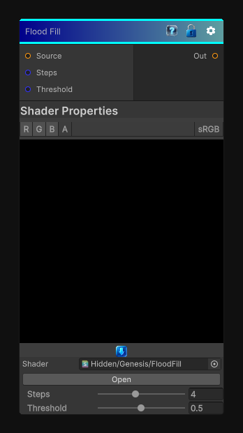

# Flood Fill

> This file is auto-generated by `Documentation/Generate-GenesisNodeDocs.ps1`.

[Back to index](../../README.md) | [Back to Effects](../../effects.md)

## Snapshot

## Details

- Menu: `Effects/Flood Fill`
- Node group: `Effects`
- Shader: `Hidden/Genesis/FloodFill`
- Source: [Runtime/Nodes/Effects/Effects/FloodFillNode.cs](../../../../Runtime/Nodes/Effects/Effects/FloodFillNode.cs)

## Documentation

Jump-Flood region propagation + stable hashing for region IDs
This produces a stable region ID map that you can feed into your other CRT nodes.
