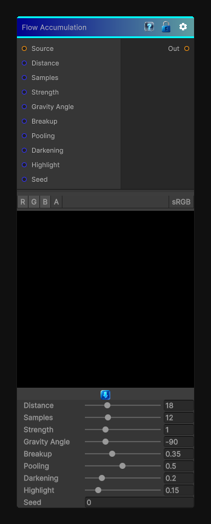

# Flow Accumulation

> This file is auto-generated by `Documentation/Generate-GenesisNodeDocs.ps1`.

[Back to index](../../README.md) | [Back to Effects](../../effects.md)

## Snapshot

## Details

- Menu: `Effects/Flow Accumulation`
- Shader: `Hidden/Genesis/FlowEffectSuite`
- Source: [Runtime/Nodes/Effects/Effects/FlowAccumulationNode.cs](../../../Doxygen/html/_flow_accumulation_node_8cs_source.html)

## Documentation

Builds a grayscale flow and pooling mask from the source texture's luminance.

Use this when you want:
- Runoff accumulation masks
- Puddle and stain drivers
- Inputs for later wetness or wear effects
