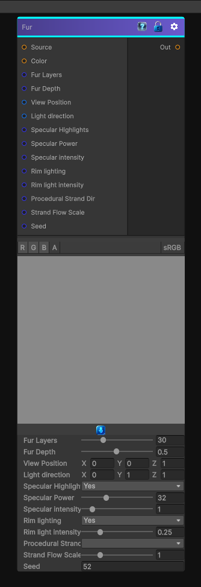

# Fur

> This file is auto-generated by `Documentation/Generate-GenesisNodeDocs.ps1`.

[Back to index](../../README.md) | [Back to Effects](../../effects.md)

## Snapshot

## Details

- Menu: `Effects/Fur`
- Node group: `Modifiers`
- Shader: `Hidden/Genesis/Fur`
- Source: [Runtime/Nodes/Effects/Modifiers/FurNode.cs](../../../Doxygen/html/_fur_node_8cs_source.html)

## Documentation

Simulates fur on a texture, color based on another texture
