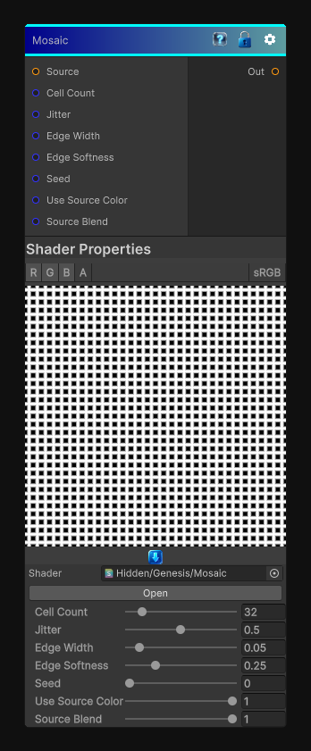

# Mosaic

> This file is auto-generated by `Documentation/Generate-GenesisNodeDocs.ps1`.

[Back to index](../../README.md) | [Back to Effects](../../effects.md)

## Snapshot

## Details

- Menu: `Effects/Mosaic`
- Node group: `Effects`
- Shader: `Hidden/Genesis/Mosaic`
- Source: [Runtime/Nodes/Effects/Effects/MosaicNode.cs](../../../../Runtime/Nodes/Effects/Effects/MosaicNode.cs)

## Documentation

- Voronoi-style cell partitioning
- Random per-cell color
- Cell jitter / irregularity
- Edge width
- Edge softness
- Seed-driven randomness
It's essentially a stylized Voronoi mosaic generator.
Below is a fully Genesis CRT-compliant implementation:
- Deterministic
- Sampler-agnostic (SAMPLE_X)
- Works for 2D / 3D / Cube
- Produces:
- Cell ID
- Random color per cell
- Edge mask
- Soft edges
