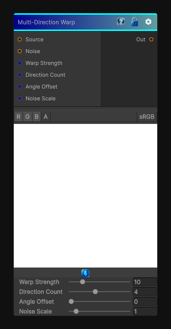

# Multi-Direction Warp

> This file is auto-generated by `Documentation/Generate-GenesisNodeDocs.ps1`.

[Back to index](../../README.md) | [Back to Effects](../../effects.md)

## Snapshot

## Details

- Menu: `Effects/Multi-Direction Warp`
- Node group: `Effects`
- Shader: `Hidden/Genesis/MultiDirectionalWarp`
- Source: [Runtime/Nodes/Effects/Effects/MultidirWarpNode.cs](../../../Doxygen/html/_multidir_warp_node_8cs_source.html)

## Documentation

- Samples the source multiple times along several directions
- Each direction is modulated by a noise map
- The offsets are blended together
- Produces a soft, organic, multi-axis distortion
- Unlike Directional Warp, it's not linear - it's multi-vector
So the Genesis CRT version needs:
- - Multiple warp directions
- - Per-direction noise sampling
- - Strength control
- - Blend mode (average)
- - Works for 2D / 3D / Cube
- - Deterministic, sampler-free, CRT-ready
