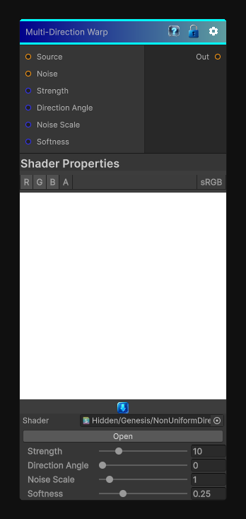

# Multi-Direction Warp

> This file is auto-generated by `Documentation/Generate-GenesisNodeDocs.ps1`.

[Back to index](../../README.md) | [Back to Effects](../../effects.md)

## Snapshot

## Details

- Menu: `Effects/Non-Uniform Directional Warp`
- Node group: `Effects`
- Shader: `Hidden/Genesis/NonUniformDirectionalWarp`
- Source: [Runtime/Nodes/Effects/Effects/NonUniformDirWarpNode.cs](../../../../Runtime/Nodes/Effects/Effects/NonUniformDirWarpNode.cs)

## Documentation

- Takes a source image
- Takes a noise/intensity map
- Takes a direction angle
- Computes a per-pixel warp offset = direction x noise x strength
- Samples the source at that offset
- Optionally applies softness (Substance's "Intensity" curve)
It's basically:
UV' = UV + dir * noise * strength
But with:
- - Direction angle
- - Noise scale
- - Strength
- - Softness shaping
- - Works on grayscale or color
