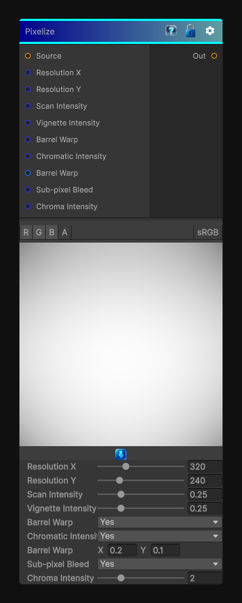

# Pixelize

> This file is auto-generated by `Documentation/Generate-GenesisNodeDocs.ps1`.

[Back to index](../../README.md) | [Back to Effects](../../effects.md)

## Snapshot

## Details

- Menu: `Effects/Pixelize`
- Node group: `Effects`
- Shader: `Hidden/Genesis/Pixelize`
- Source: [Runtime/Nodes/Effects/Effects/PixelizeNode.cs](../../../Doxygen/html/_pixelize_node_8cs_source.html)

## Documentation

Pixelization node with scan line support
