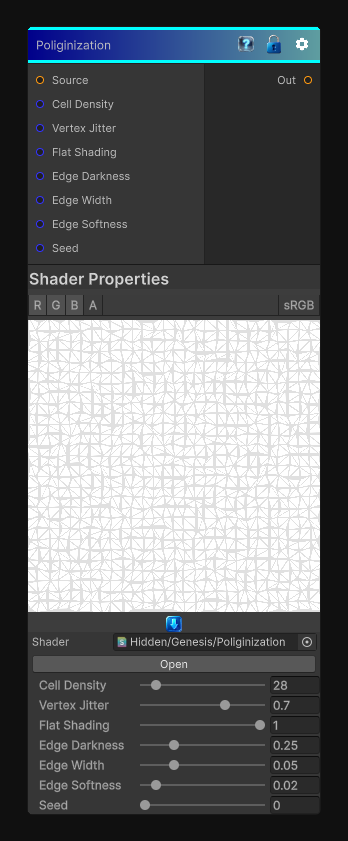

# Poliginization

> This file is auto-generated by `Documentation/Generate-GenesisNodeDocs.ps1`.

[Back to index](../../README.md) | [Back to Effects](../../effects.md)

## Snapshot

## Details

- Menu: `Effects/Poliginize`
- Aliases: `Effects/Polygonize`
- Node group: `Effects`
- Shader: `Hidden/Genesis/Poliginization`
- Source: [Runtime/Nodes/Effects/Effects/PoliginizeNode.cs](../../../../Runtime/Nodes/Effects/Effects/PoliginizeNode.cs)

## Documentation

Applies a low-poly polygonization effect by triangulating the source image into jittered cells and simplifying the color inside each triangle.
