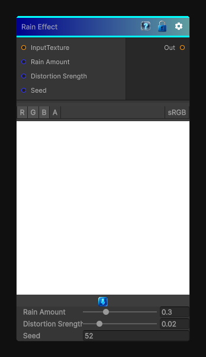

# Rain Effect

> This file is auto-generated by `Documentation/Generate-GenesisNodeDocs.ps1`.

[Back to index](../../README.md) | [Back to Effects](../../effects.md)

## Snapshot

## Details

- Menu: `Effects/Rain`
- Node group: `Effects`
- Shader: `Hidden/Genesis/RainEffect`
- Source: [Runtime/Nodes/Effects/Effects/RainNode.cs](../../../Doxygen/html/_rain_node_8cs_source.html)

## Documentation

Effect that simulates rain on the 'Camera'
