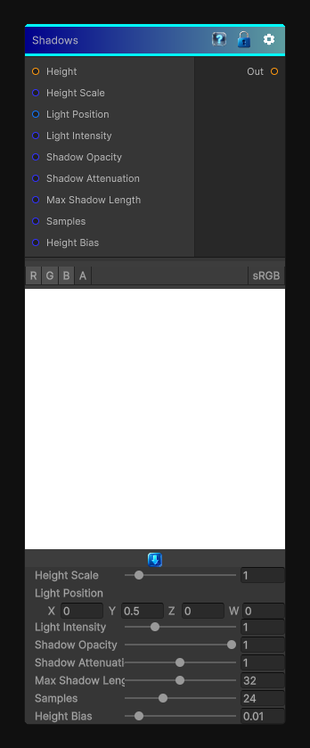

# Shadows

> This file is auto-generated by `Documentation/Generate-GenesisNodeDocs.ps1`.

[Back to index](../../README.md) | [Back to Effects](../../effects.md)

## Snapshot

## Details

- Menu: `Effects/Shadows`
- Node group: `Effects`
- Shader: `Hidden/Genesis/RTShadows`
- Source: [Runtime/Nodes/Effects/Effects/ShadowsNode.cs](../../../Doxygen/html/_shadows_node_8cs_source.html)

## Documentation

Creates ray-traced shadows from a height map, with light position, samples, max length, attenuation, opacity, and height scale.
