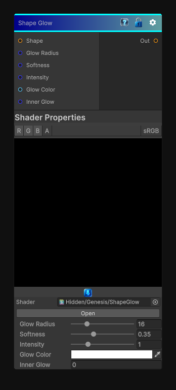

# Shape Glow

> This file is auto-generated by `Documentation/Generate-GenesisNodeDocs.ps1`.

[Back to index](../../README.md) | [Back to Effects](../../effects.md)

## Snapshot

## Details

- Menu: `Effects/Shape Glow`
- Node group: `Effects`
- Shader: `Hidden/Genesis/ShapeGlow`
- Source: [Runtime/Nodes/Effects/Effects/ShapeGlowNode.cs](../../../../Runtime/Nodes/Effects/Effects/ShapeGlowNode.cs)

## Documentation

Essentially the sibling of Shape Drop Shadow, but instead of casting a directional shadow, it creates a soft, radial, emissive halo around a binary shape.
It's not bloom, not blur, not bevel - it's a distance-based glow with:
- Glow radius
- Softness
- Intensity
- Color
- Optional inner glow
- Fully shape-aware
